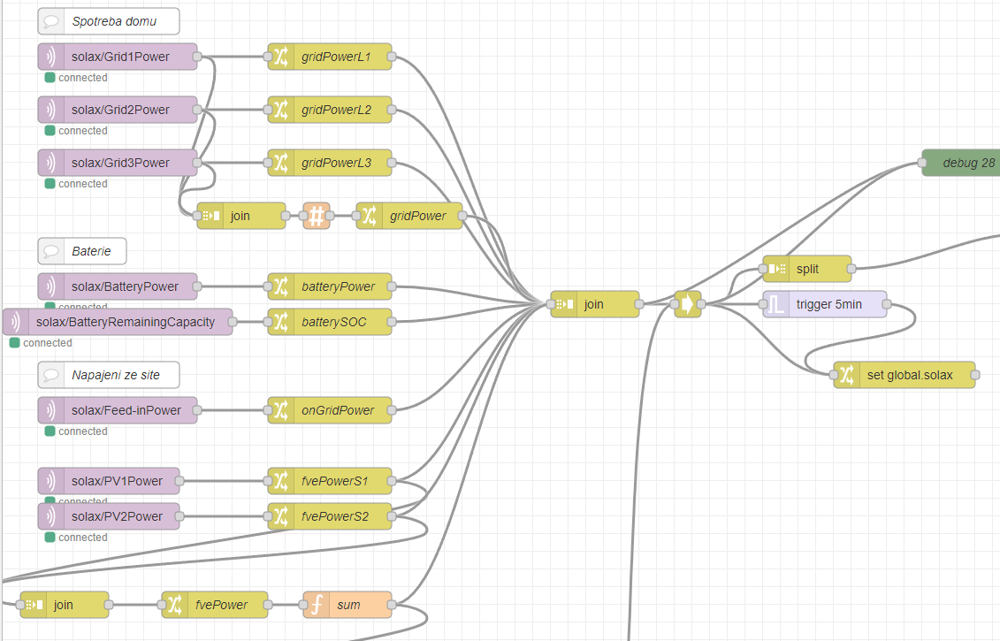
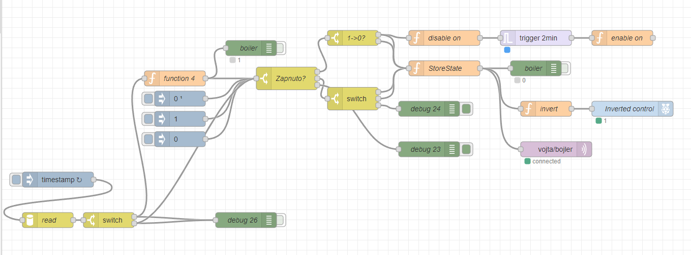
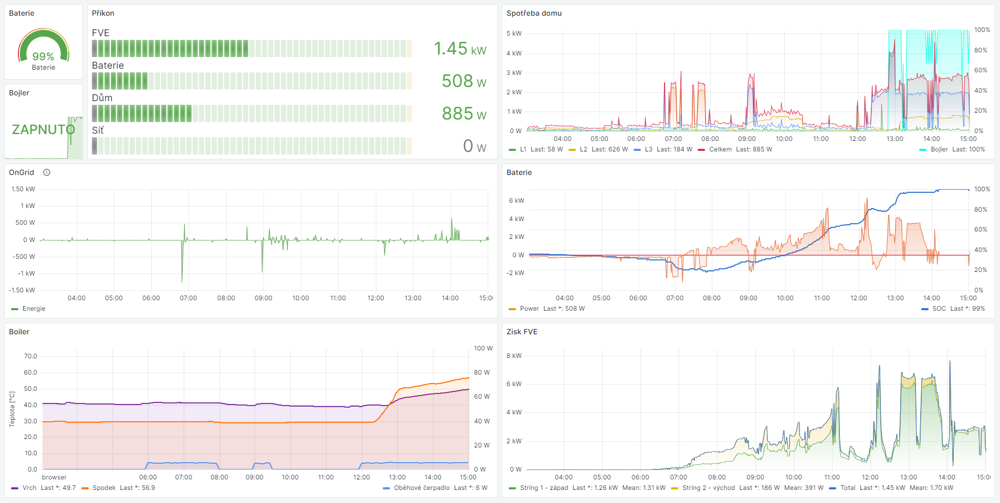

# Solax to MQTT monitor

# Principle
This tool monitors the status of the Solax system over the local network (without cloud, but Solax Cloud may be used). 
It was tested with Solax X3-G4 Hybrid. However, it uses `solax` package and can be further extended for different tools.

# Usage
## Installation
The script has some requirements. It can be run on arbitrary Linux systems such as Raspberry Pi.
It uses Python 3 language. For the installation of the requirements, use
```bash
sudo pip -r requirements.txt
```

Note that root grants are required for running as a service.

Copy the config file and fill in your details
```bash
cp monitor/config.default.yaml monitor/config.yaml
```

It will be needed to input the IP address of Solax Pocket Wifi and grants to an MQTT server (local or public).

## Simple monitoring (once)
Just run 
```monitor/current_status.py```

and you should get all the information from the inverter. These data are also exported to the MQTT server.

## Running as a service
Firstly, create a service file with a valid path using this script.
```bash
cat > monitor/solax-monitor.service << EOF
[Unit]
Description=Solax Monitor
After=multi-user.target
[Service]
Type=simple
Restart=always
ExecStart=/usr/bin/python3 `pwd`/monitor/monitor_daemon.py
[Install]
WantedBy=multi-user.target
EOF
```
Then enable the service.
```bash
sudo ln monitor/solax-monitor.service /etc/systemd/system/solax-monitor.service
sudo systemctl daemon-reload
sudo systemctl enable solax-monitor.service 
# Created symlink /etc/systemd/system/multi-user.target.wants/solax-monitor.service → /etc/systemd/system/solax-monitor.service.
sudo service solax-monitor start
```

The monitor regularly (once per minute) exports the state of the inverter to MQTT.

# Usage for load balancing and reporting
The data from MQTT can be used, for example, as an input to Node-Red or exported to InfluxDB to be shown in Grafana.

To join them together, a simple combination can be used as in this [example](nodered_solax.json)


These data can be exported to InfluxDB or used for controlling RaspberryPi Relay as shown [here](nodered_control.json)




The Grafana can be configured to show power status, temperatures, relay states, etc., as shown here


# Possible improvements
## Selection of different types of inverter
Just change the inverter in [monitor/solaxcom.py](monitor/solaxcom.py) file.

## Controlling of Export
With a new version of Pocket Wifi, Modbus TCP is also enabled. You can add listening to the MQTT and control the valid place in memory. Note that the number of writing in the memory is limited!